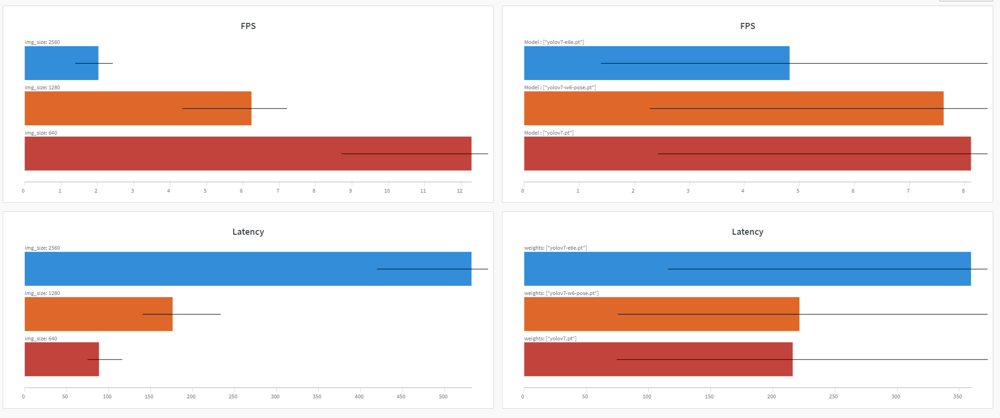

## Pose estimation

[`code`](https://github.com/WongKinYiu/yolov7/tree/pose) [`yolov7-w6-pose.pt`](https://github.com/WongKinYiu/yolov7/releases/download/v0.1/yolov7-w6-pose.pt)

See [keypoint.ipynb](https://github.com/WongKinYiu/yolov7/blob/main/tools/keypoint.ipynb).

<div align="center">
    <a href="./">
        
    </a>
</div>

## Installation and Environment setup  
### Install  
```bash=
git clone https://github.com/YunghuiHsu/yolov7.git
cd yolov7/

# Install the dependency package
pip3 install -r requirements.txt
# Please decide if you want to comment out opencv-python, torch, torchvision depending on the platform you are using
```

- [optional] download weight
```bash=
# yolov7-w6-pose.pt
wget https://github.com/WongKinYiu/yolov7/releases/download/v0.1/yolov7-w6-pose.pt
# yolov7-tiny.pt
wget wget https://github.com/WongKinYiu/yolov7/releases/download/v0.1/yolov7-tiny.pt
```

- [optional] Switching branches

```bash=
# git checkout -b detect_pose origin/detect_pose # default. can run detect or pose estimation tasks directly
git checkout -b log_metric origin/log_metric # for performance testing
git checkout -b deploy_ui origin/deploy_ui  # for deploying GUI in Jetson with YOLOv7() class
```


## Update
- brach:deploy_ui
    - Refactor and encapsulate as Yolov7 class
        - `yolov7/YOLOv7_Engine.py`
    - Add the simple UI example file implemented by pyQT
        - `LiveFrameThread.py`
        - `pyqtUI_Main.py`
    
    ```bash=
    sudo apt install python3-pyqt5
    # sudo apt install pyqt5-dev-tools  

    python3 pyqtUI_Main.py
    ```

- brach:log_metric  
    - Add the function of logging performance during inference()

        When running the python command in the terminal, add `--log_exp` and it will start logging the values of inference time, FPS, Latency and hyperparameters, which requires the libraries for wandb and mlflow to be installed.

<div align="center">
    <a href="./">
        
    </a>
</div>

- brach:detect_pose 
    - Add support for "pose estimation" from the official YOLOv7 repository

        Load ` yolov7-w6-pose.pt` weights directly into the Pytorch environment for humane skeleton detection(pose estimation)

        `detect_pose.py` modified from `detect.py`, adding support for "pose estimation" to the original `detect.py` architecture, without modifying, adding any `utils` files. Directly download and ready to use

        For environment setup and package installation, please refer to the official YOLOv7 repository

        從YOLOv7官方倉庫中增加對 "人體姿勢估計 "的支持，可以簡單地將`yolov7-w6-pos.pt`權重直接加載到Pytorch環境中進行人體姿態偵測

        `detect_pose.py`修改自`detect.py`，在原`detect.py`架構中加入了對 "姿勢估計 "的支持，沒有修改、添加任何`utils`文件。直接下載並可直接使用


##  Inference for Pose estimation
 
- On the video:
```
python detect_pose.py --weights yolov7-w6-pose.pt --conf 0.05 --iou-thres 0.65 --img-size 1280 --source yourvideo.mp4 --no-trace 
```

- On the image:
```
python detect_pose.py --weights yolov7-w6-pose.pt --conf 0.05 --iou-thres 0.65 --img-size 1280 --source inference/images/horses.jpg --no-trace 
```

- On the webcam:  
    add `0` after --source
```
python detect_pose.py --weights yolov7-w6-pose.pt --conf 0.05 --iou-thres 0.65 --img-size 1280 --source 0 --no-trace 
```

#### Test

- Crowded multi-person scenes
<div align="center">
    <a href="./">
        
    </a>
</div>

- Upside-down human posture
<div align="center">
    <a href="./">
        
    </a>
</div>

## Citation

```
@article{wang2022yolov7,
  title={{YOLOv7}: Trainable bag-of-freebies sets new state-of-the-art for real-time object detectors},
  author={Wang, Chien-Yao and Bochkovskiy, Alexey and Liao, Hong-Yuan Mark},
  journal={arXiv preprint arXiv:2207.02696},
  year={2022}
}
```
