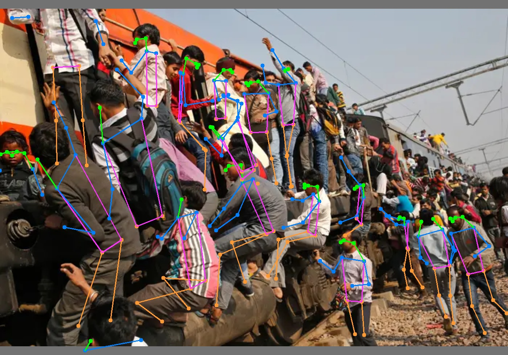
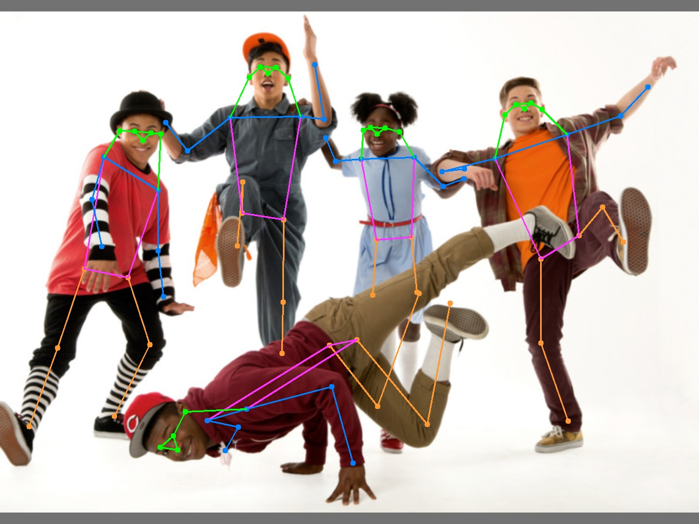

## Pose estimation

[`code`](https://github.com/WongKinYiu/yolov7/tree/pose) [`yolov7-w6-pose.pt`](https://github.com/WongKinYiu/yolov7/releases/download/v0.1/yolov7-w6-pose.pt)

See [keypoint.ipynb](https://github.com/WongKinYiu/yolov7/blob/main/tools/keypoint.ipynb).


<div align="center">
    <a href="./">
        
    </a>
</div>

### Update note
- Add the function of logging performance during inference

    git switch to "log_metric" branch 
    
    ```
    git checkout -b log_metric  origin/log_metric
    ```

     When running the python command in the terminal, add `--log_exp` and it will start logging the values of inference time, FPS, Latency and hyperparameters, which requires the libraries for `wandb` and `mlflow` to be installed.


- Add support for "pose estimation" from the official YOLOv7 repository

    Load ` yolov7-w6-pose.pt` weights directly into the Pytorch environment for humane skeleton detection(pose estimation)

    `detect_pose.py` modified from `detect.py`, adding support for "pose estimation" to the original `detect.py` architecture, without modifying, adding any `utils` files. Directly download and ready to use

    For environment setup and package installation, please refer to the official YOLOv7 repository

    從YOLOv7官方倉庫中增加對 "人體姿勢估計 "的支持，可以簡單地將`yolov7-w6-pos.pt`權重直接加載到Pytorch環境中進行人體姿態偵測

    `detect_pose.py`修改自`detect.py`，在原`detect.py`架構中加入了對 "姿勢估計 "的支持，沒有修改、添加任何`utils`文件。直接下載並可直接使用


### Install 
    Please refer to the official YOLOv7 repository for environment settings and dependency package installation.
    關於環境設置和相依套件的安裝，請參考YOLOv7的官方資源庫


###  Inference for Pose estimation

- Download yolov7-w6-pose.pt
```
wget https://github.com/WongKinYiu/yolov7/releases/download/v0.1/yolov7-w6-pose.pt
```

#### On the video:
```
python3 detect_pose.py --weights yolov7-w6-pose.pt --conf 0.05 --iou-thres 0.65 --img-size 640 --source yourvideo.mp4 --no-trace --log_exp
```

#### On the image:
```
python3 detect_pose.py --weights yolov7-w6-pose.pt --conf 0.05 --iou-thres 0.65 --img-size 640 --source inference/images/horses.jpg --no-trace --log_exp
```

#### On the webcam:  
    add `0` after --source
```
python3 detect_pose.py --weights yolov7-w6-pose.pt --conf 0.05 --iou-thres 0.65 --img-size 640 --source 0 --no-trace --log_exp
```

#### Demo

- Crowded multi-person scenes
<div align="center">
    <a href="./">
        
    </a>
</div>

- Upside-down human posture
<div align="center">
    <a href="./">
        
    </a>
</div>


## Citation

```
@article{wang2022yolov7,
  title={{YOLOv7}: Trainable bag-of-freebies sets new state-of-the-art for real-time object detectors},
  author={Wang, Chien-Yao and Bochkovskiy, Alexey and Liao, Hong-Yuan Mark},
  journal={arXiv preprint arXiv:2207.02696},
  year={2022}
}
```
